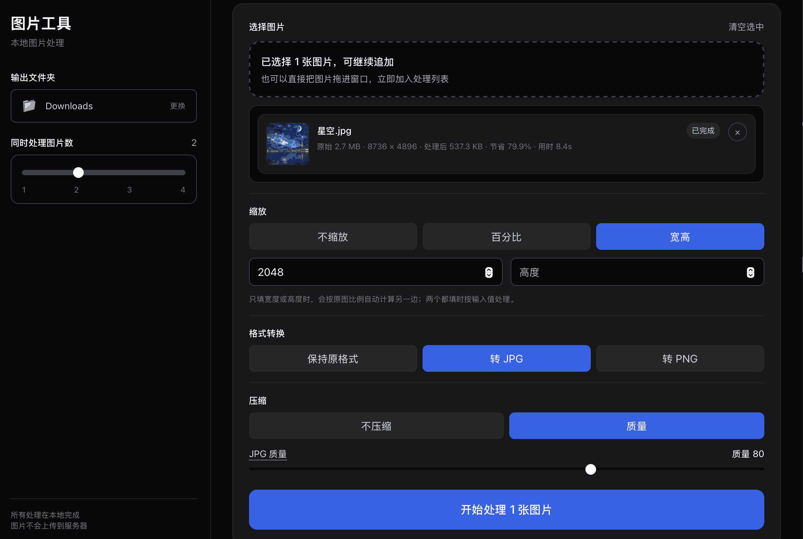

# Image Tool - Mac 图片处理工具

一个基于 Tauri 开发的 macOS 原生图片处理应用，所有处理在本地完成，图片不会上传到服务器。



## 功能

1. **格式转换** - 在 JPG、JPEG、PNG 格式之间互相转换
2. **图片缩放** - 支持按尺寸或百分比等比缩放
3. **图片压缩** - 调整图片质量，减小文件体积
4. **蒙版转透明** - 使用蒙版图片将指定区域转为透明

## 技术栈

- **前端**: React + TypeScript + Vite + TailwindCSS
- **后端**: Tauri (Rust)
- **图片处理**: Rust `image` crate + `imageproc`

## 开发

```bash
# 安装依赖
npm install

# 启动开发模式
npm run tauri:dev

# 构建
npm run build
npm run tauri:build
```

## 构建

构建后的应用将生成 `src-tauri/target/release/bundle/macos/` 目录下的 `.app` 文件。

## 项目结构

```
image-tool/
├── src/                   # React 前端
│   ├── components/         # UI 组件
│   ├── hooks/             # 自定义 Hooks
│   ├── lib/               # Tauri API 封装
│   └── types/             # TypeScript 类型
├── src-tauri/            # Rust 后端
│   ├── src/
│   │   ├── commands.rs    # Tauri 命令
│   │   ├── utils.rs       # 工具函数
│   │   ├── main.rs        # 入口
│   │   └── lib.rs        # 库文件
│   ├── tauri.conf.json   # Tauri 配置
│   └── Cargo.toml        # Rust 依赖
```
